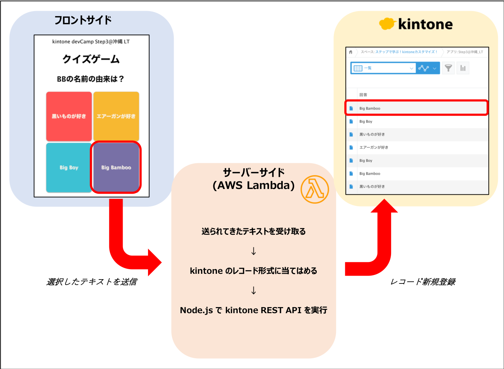

# kintone devCamp Step3 LT

LTで発表したクイズゲームのプログラムになります。 
[Webページ](https://rybb.github.io/kintone-de-quiz/front/src/html/index.html)

## ファイル構造

- front/src
  - フロントサイド部分(HTML/CSS/JS)が記載されています。
    - GitHub Pagesを利用して外部公開しています。
- server
  - サーバーサイド部分(Node.js)が記載されています。
    - AWS Lambdaに実装しています。

## 仕組み

